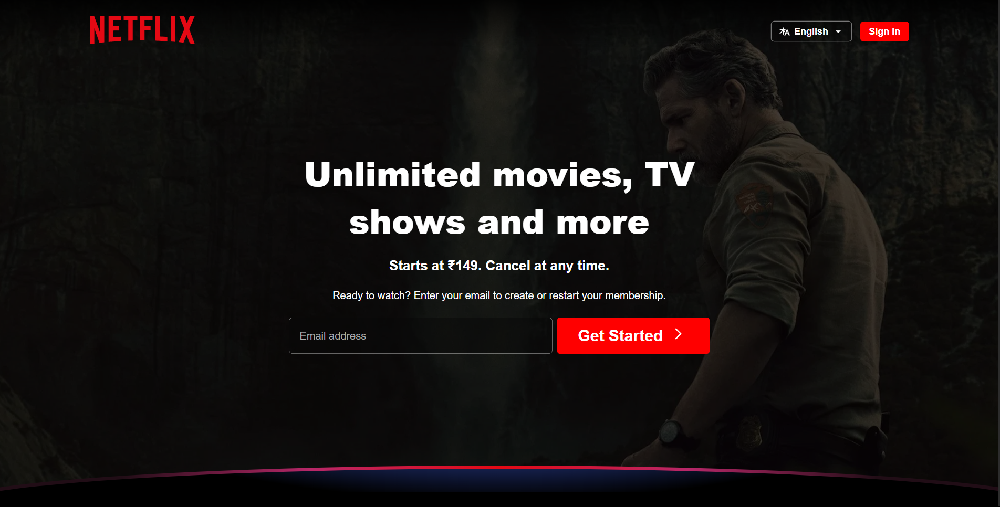
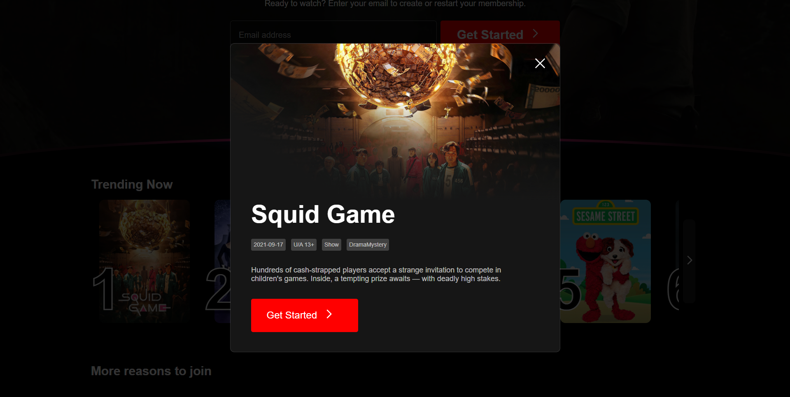

# Netflix UI Clone 🎬

A fully responsive Netflix clone built using **React.js**, styled with **CSS**, and deployed using **Vercel**. This project replicates the UI/UX of Netflix's landing page and integrates with **TMDb API** to fetch trending movies and shows dynamically.

### 🔗 Live Demo
[https://netfli-x-ui-clone-arx.vercel.app](https://netfli-x-ui-clone-arx.vercel.app)

---

## 📸 Screenshots



---

## 🚀 Features
- Netflix-style responsive UI
- Movie previews on hover
- Trending movies & shows fetched from TMDb API
- Modal preview of selected movie/show
- Clean and modular React components
- Mobile responsive design

---

## 🛠️ Tech Stack
- React.js
- HTML5 & CSS3
- TMDb API
- Vite (for fast development)
- Vercel (for deployment)

---

## 📁 Folder Structure
src/
├── Components/
│ ├── Navbar/
│ ├── Banner/
│ ├── RowPost/
│ ├── PreviewModal/
│ └── LanguageSelector/
├── Constants/
└── App.jsx

---

## 📦 Setup & Installation

```bash
git clone https://github.com/abinrajesh/netflix-ui-clone-arx.git
cd netflix-ui-clone-arx
npm install
npm run dev